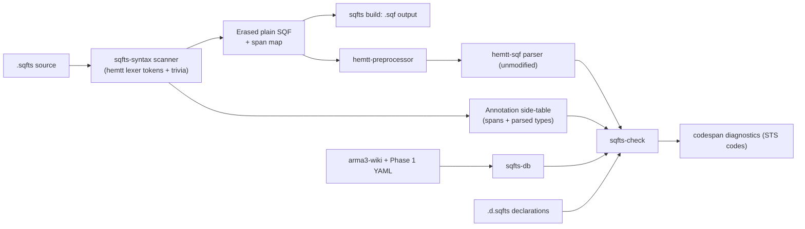

# Phase 3 — SQFts Compiler Toolchain

Implements the [language specification](language-specification.md) as working code in the existing Cargo workspace. Target: `sqfts check` and `sqfts build` running end-to-end on real codebases.

## Architecture: two planes, one scanner

Research finding that drives the design: `hemtt-sqf`'s AST **drops comments and whitespace** (the lexer strips them before parsing), so the erasure emitter cannot be an AST printer and still satisfy E1–E3 (byte-identity, determinism, locality). Erasure must be span-based rewriting of original bytes.

Therefore the front end is a **token-level annotation scanner**, not a grammar fork:

- The scanner lexes raw `.sqfts` with a trivia-preserving lexer (comments/whitespace kept, spans exact), recognizes the SPEC §6 constructs using the disambiguation rules (contextual `type`/`declare`/`interface`/`as`, `:` only after `private` local or params string), parses type expressions with a small recursive-descent parser, and emits (a) an annotation side-table keyed by original byte span and (b) the erased source per the §7.2 table.
- Checking runs on the **erased** source through the stock preprocessor and parser; AST spans map back through the preprocessor source map plus the eraser's span map to original bytes, where annotations are looked up. Diagnostics always point at original `.sqfts` locations.
- **v1 restriction (specification deviation to record):** annotations must appear literally in source, not be produced by macro expansion. Erasure runs pre-preprocess, so annotations inside macro bodies are out of scope for v1.

## Dependency strategy (per your "vendor" choice)

- Vendor `HEMTT/libs/sqf` into `crates/hemtt-sqf`, pinned to a recorded upstream commit, **parser feature only** (drop the `compiler`/SQFC feature and its `hemtt-lzo` dep). Keep the diff near zero — we use its lexer, AST, and `Database`; our checker is a separate crate rather than an inspector modification.
- `hemtt-common`, `hemtt-workspace`, `hemtt-preprocessor` as git dependencies pinned to the same rev (they are unpublished but resolvable from the HEMTT monorepo).
- `arma3-wiki` from crates.io (already used by Phase 1). Workspace stays GPL-2.0 (already set in [`Cargo.toml`](../../Cargo.toml)).

Rationale for a separate checker instead of extending the inspector: the inspector's set-of-GameValue model has no notion of brands, tuples, interfaces, or declared user-function signatures; retrofitting those would gut its upstream mergeability, which was the point of keeping the fork minimal.

## New crates

- `crates/sqfts-syntax` — trivia-preserving lex, annotation scanner, type-expression parser, `Type` model (primitives from Phase 1 `SqfType`, unions, `T[]`, tuples with optional tails, brands, alias references), eraser with span map. No dependency on the preprocessor; pure text/tokens.
- `crates/sqfts-db` — loads arma3-wiki dist (crate data) and overlays Phase 1 enrichment (`out/patches`: concrete types where wiki has `Unknown`); converts wiki `Value` + Phase 1 `SqfType` into checker `Type`s; exposes nular/unary/binary overload lookup.
- `crates/sqfts-check` — symbol tables (locals per scope, project globals, declared functions, type aliases, interfaces), declaration-file loader with duplicate-conflict detection, expression typing per SPEC §5 (overload resolution, statement-result typing, `call`/`spawn`/`remoteExec` against declarations, hashMap interfaces, casts, `isNil`/`isEqualType` narrowing), assignability including brand rules (§1.5), strictness flags (§5.1).
- `crates/sqfts-cli` — binary `sqfts`; `sqfts.toml` discovery and config (source globs, declaration paths, flags, `emitRuntimeParams`); `check` and `build` subcommands; `codespan-reporting` output with stable `STS****` codes.

## Milestones (each independently testable)

**M0 — Workspace setup.** Vendor `hemtt-sqf` (parser-only), add git deps pinned to one rev, empty crate skeletons, everything compiles. Record vendored commit in `crates/hemtt-sqf/UPSTREAM.md`.

**M1 — Scanner + eraser (the superset property).** Token scanner, type parser, all §7.2 erasure rules including the `private _x: T;` → `private "_x";` rewrite and `"_p": T = expr` → `["_p", expr]`. Tests: E1 identity on plain SQF (byte-for-byte), golden before/after pairs for every SPEC §3 example including the §7.3 worked example, determinism (E2).

**M2 — `sqfts build`.** CLI, `sqfts.toml`, file discovery, `.sqfts` → `.sqf` emission, `emitRuntimeParams` lowering with the §7.4 type-to-exemplar table. Mass identity regression against a private real-world corpus supplied through the `SQFTS_TEST_CORPUS` environment variable (skipped when unset), plus committed synthetic fixtures.

**M3 — Type database.** `sqfts-db` loading + Phase 1 overlay, wiki→`Type` conversion (including mapping wiki `Waypoint`/position formats onto brands), overload tables for all ~2,690 commands. Tests: spot-check `addAction`, `getPos`, `setDamage`, `forEach`, `select`, `remoteExec` signatures.

**M4 — Declarations.** `.d.sqfts` parsing (scanner already handles the syntax), project symbol table, duplicate-declaration conflict errors, alias/interface registration.

**M5 — Checker core.** Expression typing over the parsed AST with annotation lookup via the composed span maps; §2 resolution priority; assignability lattice with `any`, brands, tuples→arrays decay; overload resolution semantics from §5 (first-match, `any`-union fallback); typed `params`/`private`; `call`/`spawn`/`remoteExec` with declared functions including the 1-tuple/bare-value rule; interfaces for `get`/`set`; `as` casts with overlap check; `isNil`/`isEqualType` narrowing; declaration-vs-definition agreement.

**M6 — Diagnostics and flags.** Stable STS code registry, codespan rendering with primary + related spans mapped to original source, all five §5.1 flags (`noImplicitAny`, `strictNil`, `noPositionBrands`, `strictHashMap`, `checkPlainSqf`).

**M7 — Validation and docs.** Run `check` + `build` over the corpus: zero false positives on plain SQF with flags off is the acceptance bar; SPEC §8 worked example reproduces its two diagnostics exactly; §10 conformance checklist swept; README and SPEC status updated (including the v1 macro restriction note).

## Testing approach

- `insta` snapshot tests for diagnostics; golden byte-comparison for erasure; unit tests per crate.
- Corpus harness is `#[ignore]`-gated / env-gated so CI passes without the private downstream corpus.

## Out of scope (unchanged from SPEC §9)

Typed code values, literal types, generics, `hashMap<K,V>`, event-handler payload typing, LSP/editor support (Phase 4).