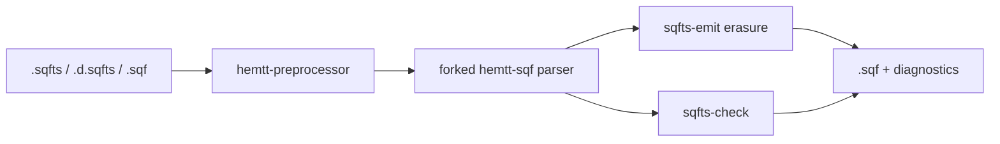

# Phase 3 — SQFts compiler toolchain

## Approach (locked)

- **Vendor** a pinned commit of BrettMayson/HEMTT under [`vendor/hemtt/`](../../vendor/hemtt/) (needed libs only: `common`, `workspace`, `preprocessor`, `sqf`, plus transitive `pbo`/`lzo`). Path-deps from the workspace — not crates.io (stale) and not a live `main` git dep.
- **Fork only `libs/sqf`** in that tree: keep package name `hemtt-sqf`, extend AST/lexer/parser as a **strict SQFsuperset** so upstream inspector/lint merges stay tractable. Leave workspace/preprocessor untouched.
- **Accept GPL-2.0** (already on the workspace); document HEMTT provenance + pin in `vendor/hemtt/UPSTREAM.md`.
- **Do not** implement Phase 4 LSP/downstream declaration generators yet.



## Workspace layout

| Path | Role |
|---|---|
| `vendor/hemtt/` | Pinned HEMTT subset + `UPSTREAM.md` (commit SHA, sync notes) |
| [`crates/comref-extract`](../../crates/comref-extract) | Unchanged (Phase 1) |
| `crates/sqfts-types` | SPEC type model: primitives, unions, arrays/tuples, brands, assignability, `TypeExpr` AST for annotations |
| `crates/sqfts-check` | Declarations store, call-site checks for `declare function`, wraps inspector issues → STS codes |
| `crates/sqfts` | CLI: `sqfts check`, `sqfts build`; loads `sqfts.toml` |

Root [`Cargo.toml`](../../Cargo.toml) gains members + path deps on `vendor/hemtt/libs/{common,workspace,preprocessor,sqf}`. Disable SQF `compiler` feature unless needed.

## 1. Vendor + smoke

- Shallow-clone HEMTT at a fixed commit into `vendor/hemtt` (gitignore large unused trees if needed, or copy only required `libs/*`).
- Wire path deps; add a tiny integration test: preprocess + parse a plain `.sqf` string via existing HEMTT APIs (`Processor` → `Processed` → `parser::run`).
- Confirm Rust edition: HEMTT uses **2024**; bump workspace edition if required for those crates.

## 2. Fork `hemtt-sqf` for annotations ([language specification](language-specification.md) §3, §6)

Extend in `vendor/hemtt/libs/sqf` (or a thin wrap if we prefer fewer vendor diffs — default is **in-tree fork**):

**AST additions** (closed enums today in `libs/sqf/src/lib.rs`):

- `Statement`: `TypeAlias`, `Interface`, `DeclareVar`, `DeclareFn`, typed `AssignLocal` carrying optional type annotation
- `Expression`: `Cast { expr, ty }`
- Shared `TypeExpr` node (union / array / tuple / named / optional)

**Lexer/parser** (`parser/lexer.rs`, `parser/mod.rs`):

- Contextual keywords: `type`, `declare`, `interface`, `as` per SPEC disambiguation
- Typed `private _x: T [= expr]` and typed `params` entries (`"_"?: T [= expr]`)
- Preserve: every valid SQF still parses identically (golden tests from HEMTT + new sqfts fixtures)

**Inspector compatibility:** when running HEMTT’s `inspector::run_processed`, strip or map annotation-only nodes to their erased SQF shape so `GameValue` does not see unknown variants. Prefer a `to_plain_sqf_ast()` view rather than duplicating the whole inspector.

## 3. Emitter — erasure ([language specification](language-specification.md) §7)

In `crates/sqfts` (or `sqfts-check` helper):

- Implement the §7.2 rewrite table with **span-local** edits on the **unpreprocessed** source (E1–E4).
- Default: no runtime params lowering; honor `emitRuntimeParams` later if flagged in `sqfts.toml`.
- Tests: SPEC §7.3 impound example; identity on annotation-free files (byte-identical).

## 4. Types + declarations

`crates/sqfts-types`:

- Surface names from SPEC §1.1 mapped to Phase 1 / wiki vocabulary
- Assignability: `any` bidirectional; brands vs structural tuples; unions
- Parse `TypeExpr` from annotation spans (shared with forked parser or re-exported)

`crates/sqfts-check`:

- Load all `.d.sqfts` discovered via `sqfts.toml` (`include` globs; default `**/*.d.sqfts`)
- Conflict detection for duplicate `declare`s
- Check `call` / `spawn` / string-literal `remoteExec` against `declare function`
- Check declared globals on assign/read
- Engine calls: reuse forked inspector + arma3-wiki `Database` for arity/type; map issues to `STSxxxx` diagnostics via codespan (`hemtt-workspace` reporting)
- Strictness flags from SPEC §5.1 default **off** in `sqfts.toml`

Minimal first `sqfts.toml`:

```toml
[project]
name = "example"

[check]
# noImplicitAny = false
# checkPlainSqf = false

[build]
out_dir = "sqfts-out"
# emitRuntimeParams = false
```

## 5. CLI

`crates/sqfts` with clap:

- `sqfts check [PATH]` — parse, typecheck, print codespan diagnostics, exit non-zero on errors
- `sqfts build [PATH]` — check + erase `.sqfts` → `out_dir/**/*.sqf` (skip `.d.sqfts`; copy/pass-through `.sqf` when `checkPlainSqf` only)

## 6. Docs / plan bookkeeping

- Update the project [`README.md`](../../README.md): Phase 3 status, GPL note, CLI quick start
- Mark Phase 3 todos on the existing plan file when done
- Fixture tree: `crates/sqfts/tests/fixtures/{ok,err}/` covering typed private/params, declare, cast, erasure identity

## Out of scope (Phase 4 / later)

- LSP / editor extension
- Private downstream `.d.sqfts` generator
- Full narrowing beyond `isNil` / `isEqualType`
- Typed `code(...)` values, generics, event-handler tables
- Upstreaming COMREF patches to arma3-wiki

## Delivery order (implementation sequence)

1. Vendor + smoke parse
2. AST/grammar annotations + fixture parse tests
3. Erasure emitter + identity tests → `sqfts build` works on annotated files
4. Declaration loader + assignability + call-site checks → `sqfts check`
5. Wire inspector for engine-command checking; polish diagnostics
6. README + example `sqfts.toml`
