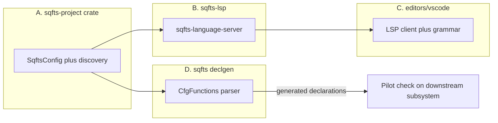

# Phase 4 — LSP, Editor Extension, Downstream Pilot, Wiki Upstreaming

## Context

Phases 1–3 delivered the type database, SPEC, and a working `sqfts check`/`build` CLI. Phase 4 has four deliverables (all in scope per your answer):

1. LSP server following HEMTT's `hls` pattern (tower-lsp)
2. VS Code/Cursor extension
3. `.d.sqfts` declaration generator, piloted against a private downstream codebase
4. Upstream-ready arma3-wiki patches from Phase 1 diff output

## A. Extract shared project layer (prerequisite)

`SqftsConfig`, `collect_sources`, `collect_decls`, and diagnostic emission currently live only in the `sqfts` binary (`crates/sqfts-cli/src/config.rs`, `report.rs`). The LSP and declgen need them.

- New crate `crates/sqfts-project`: move `SqftsConfig` (TOML load + defaults), source/declaration discovery walkers, and a `Project` struct that owns `CommandDb` (via `load_shared`), `DeclarationSet`, and `CheckFlags`, with `check_file(path, source) -> CheckResult` and `reload_declarations()`.
- `sqfts-cli` becomes a thin consumer; codespan terminal rendering stays CLI-only. Existing CLI tests must keep passing unchanged.

## B. `sqfts-lsp` crate — language server

New crate `crates/sqfts-lsp`, binary `sqfts-language-server`, stdio transport, `tower-lsp = "0.20"` + `tokio` (same stack as HEMTT hls).

- **State**: workspace root from `initialize`; load `Project` once; `DashMap<Url, String>` of open document text (full-sync `didChange`).
- **Diagnostics**: on open/change/save, run `Project::check_file` on the buffer and publish. Convert `sqfts_check::Diagnostic` byte spans to UTF-16 LSP positions via a line-index helper (byte-offset → `Position`); map `StsCode` to `Diagnostic.code`, `related` spans to `relatedInformation`. Debounce `didChange` (~300ms) since each check spins up a fresh HEMTT memory workspace.
- **Declaration/config watching**: on `didSave` of any `*.d.sqfts` or `sqfts.toml`, call `reload_declarations()` (or reload the whole `Project` for config) and re-check open documents.
- **Hover**: identify the word at the cursor; if it's an engine command, render its overloads from `CommandDb` (signature + return types); if it's a declared function/global from the `DeclarationSet`, render its `declare` signature. No checker changes needed — this is symbol-table lookup, not inferred-type-at-position (that would require `check_source` to return a type map; explicitly deferred).
- **Completion** (cheap win): command names from `CommandDb` plus declared symbols, keyword-triggered.
- Tests: unit tests for the byte-offset→UTF-16 converter and diagnostic mapping; an integration test driving the `LanguageServer` trait methods directly (no real transport).

## C. VS Code/Cursor extension — `editors/vscode/`

- `package.json`: contributes language `sqfts` (extensions `.sqfts`, `.d.sqfts`), language configuration (line comments `//`, brackets), and a TextMate grammar — base it on an existing SQF grammar plus scopes for the SPEC §6 deltas (`type`/`interface`/`declare`/`as` contextual keywords, `: Type` annotations, primitive type names).
- TypeScript client using `vscode-languageclient`: spawns `sqfts-language-server`, with a `sqfts.serverPath` setting; default resolution order — setting, bundled binary, `PATH`.
- Build with `esbuild`; package via `vsce package` and a short `npm run` script that copies the release binary in. Install locally in Cursor via install-from-VSIX. No marketplace publishing in this phase.
- Smoke test: open the sqfts repo's own test fixtures, confirm squiggles and hover.

## D. Declaration generator + downstream pilot

New CLI subcommand `sqfts declgen <config-file> --tag-default <TAG> --out <file>` (implementation in `sqfts-project` or its own module in the CLI).

- **CfgFunctions parser**: hand-rolled parser for the `class Group { tag = "TAG"; class Section { file = "functions"; class fnName {}; } }` shape used by common `Functions.h` and `config.cpp` registries. Skip non-CfgFunctions top-level classes in `config.cpp`.
- **Param inference**: for each function, resolve `<file>\fn_<name>.sqf` relative to the config's root; parse the file's leading `params` statement (reuse `hemtt-sqf` parse of just the first statements, or a tolerant scanner) and map guard arrays to types per SPEC §7.4's exemplar table in reverse (`[0]`→`number`, `[""]`→`string`, `[objNull]`→`object`, `[[]]`→`array`, multi-exemplar→union); entries with defaults become optional params. No `params` or unresolvable file → `(...): any` with all-`any` varargs-style placeholder per SPEC §4 ("skeleton with `any` to tighten by hand"). Return type is always `any` in generated output.
- **Output**: one `declare function TAG_fnc_name(...) : any;` per entry, grouped by section with comment headers and emitted to a project declaration file.
- **Pilot**: generate declarations into a gitignored, `sqfts.toml`-configured folder in a private downstream working copy, enable `check_plain_sqf`, and run `sqfts check` against one representative subsystem. Deliverable: a short findings report (real type errors found versus checker false positives), which doubles as validation of the whole toolchain.
- Tests: fixture `Functions.h`/`config.cpp` snippets + golden `.d.sqfts` output; pilot run is manual/scripted, not CI.

## E. arma3-wiki upstream patch preparation

`out/patches/*.yml` are enrichment *reports*, not mergeable wiki files. Add `comref-extract emit-wiki-patches`:

- Reuse the existing `.wiki-cache` clone ([crates/comref-extract/src/diff.rs](../../crates/comref-extract/src/diff.rs)); for each `Enrichment`, load the corresponding wiki command YAML, apply the concrete type at `location` (replacing `Unknown`), and write the modified file to `out/wiki-upstream/commands/`.
- Emit `out/wiki-upstream/PR.md` summarizing per-command changes with COMREF citations, ready to paste into an acemod/arma3-wiki PR. Filing the PR itself is manual.
- Only apply high-confidence enrichments (`Unknown` → concrete); mismatches stay report-only.

## Order and validation

Build order: A → B → C (each depends on the previous); D needs only A; E is independent. Each step: `cargo test` green, plus `cargo build --release` of the language server before extension packaging. Final acceptance: open a `.sqfts` file in Cursor with the extension installed and see live diagnostics + hover; run the private downstream declgen pilot and produce the findings report; `out/wiki-upstream/` populated.